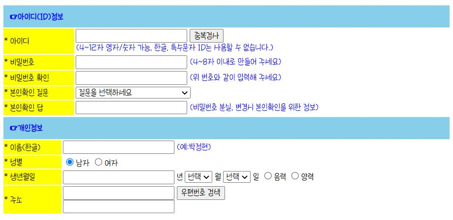

### 🎼Study CSS🎼
---
1. [ex19_css.html](./ex19_css.html)
   - CSS란 무엇인가👢
   - CSS정의 방식(내부정의, 외부파일정의, inline 정의)
   - **내부**에 style태그를 이용하여 정의
2. [ex20_css2.html](./ex20_css2.html)
   + [css/style.css](./css/style.css) 를 통해 외부파일 정의로 style 지정🪁
   - **외부파일**에서 태그를 사용하여 style을 지정할 수 있다.
3. [ex21_css3.html](./ex21_css3.html)
   - 외부에 스타일을 정의 + *@import*를 통한 style 참조⚽
   - 하지만 @import 보다는 주로 **link태그를 권장**한다.
4. [ex22_css4.html](./ex22_css4.html)
   - 태그 안에 inline으로 style 속성을 작성한 후 참조👜
   - **inline style**이 가장 *우선순위가 높게* 적용된다.
5. [ex23_selector.html](./ex23_selector.html)
   - 선택자(Selector) 유형⛳
   - **아이디 > 클래스 > 계층(부모-자식 같은경우) > 태그 선택자** 순으로  선택자 우선순위가 높다.
6. [ex24_signup.html](./ex24_signup.html)
   - 회원가입 실습🎭
   - 하위는 상위와 유사하므로 생략
   - 
7. [ex25_selector_desc.html](./ex25_selector_desc.html)
   - 계층선택자를 이용하여 Style 적용🏒
   - >, 공백, +, ~ 로 표현
8. [ex26_selector_state.html](./ex26_selector_state.html)
   - 상태선택자를 이용하여 Style 적용🎾
9.  