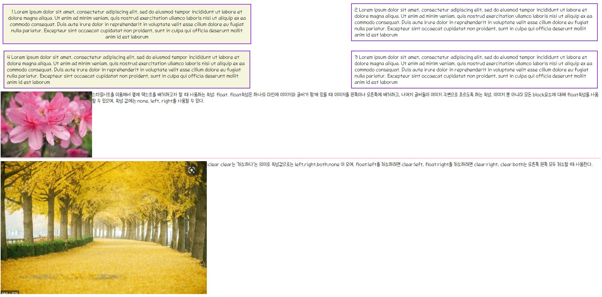

### 🎼Study CSS🎼
---
1. [ex19_css.html](./ex19_css.html)
   - CSS란 무엇인가👢
   - CSS정의 방식(내부정의, 외부파일정의, inline 정의)
   - **내부**에 style태그를 이용하여 정의
2. [ex20_css2.html](./ex20_css2.html)
   + [css/style.css](./css/style.css) 를 통해 외부파일 정의로 style 지정🪁
   - **외부파일**에서 태그를 사용하여 style을 지정할 수 있다.
3. [ex21_css3.html](./ex21_css3.html)
   - 외부에 스타일을 정의 + *@import*를 통한 style 참조⚽
   - 하지만 @import 보다는 주로 **link태그를 권장**한다.
4. [ex22_css4.html](./ex22_css4.html)
   - 태그 안에 inline으로 style 속성을 작성한 후 참조👜
   - **inline style**이 가장 *우선순위가 높게* 적용된다.
5. [ex23_selector.html](./ex23_selector.html)
   - 선택자(Selector) 유형⛳
   - **아이디 > 클래스 > 계층(부모-자식 같은경우) > 태그 선택자** 순으로  선택자 우선순위가 높다.
6. [ex24_signup.html](./ex24_signup.html)
   - 회원가입 실습🎭
   - 하위는 상위와 유사하므로 생략
   - 
7. [ex25_selector_desc.html](./ex25_selector_desc.html)
   - 계층선택자를 이용하여 Style 적용🏒
   - >, 공백, +, ~ 로 표현
8. [ex26_selector_state.html](./ex26_selector_state.html)
   - 상태선택자를 이용하여 Style 적용🎾
   - 태그:상태{} 형태로 적용
   - not() 함수처럼 사용하여 not 표현
9. [ex27_selector_state2.html](./ex27_selector_state2.html)
   - 가상 클래스 선택자를 이용하여 Style 적용👠
   - firstchild, lastchild, nth-child . . .
10. [ex28_selector_pseud.html](./ex28_selector_pseud.html)
    - 가상요소 선택자를 이용하여 Style 적용🎨
    - first-letter, first-line, before, after . . .
11. [ex29_font.html](./ex29_font.html)
    - 글자 또는 텍스트 Style 적용🥁
    - overline, underline, line-through, textshadow . . 
    - vertical align, text align . .
    - text transform. . .
12. [ex30_background.html](./ex30_background.html)
    - 배경과 관련된 Style 적용👙
13. [ex31_float.html](./ex31_float.html)
    - 화면상에 떠있는 것 같은 화면 공간을 만들기📻
    - float : 왼쪽 혹은 오른쪽으로 배치
    - clear : float을 해지
    - 
14. [ex32_em.html](./ex32_em.html) & [ex33_rem.html](./ex33_rem.html)
    - 'em'단위는 중첩(상속)이 적용된다. -> 'rem'을 쓰면 상속이 적용되지 않는다!🧶
15. [ex34_important.html](./ex34_important.html)
    - 우선순위로 인해 속성이 먹히지 않는 경우 **!important**를 이용하자🧵
16. [ex35_layer.html](./ex35_layer.html)
    - Layer를 구성🖼
    - position을 이용하여 type 변경(default는 static)
    - z-index로 순서 적용
17. 